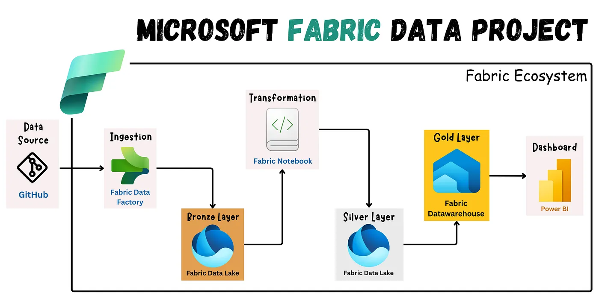

# Microsoft Fabric Data Engineering Project

This project demonstrates the end-to-end development of a data warehouse solution using Microsoft Fabric, based on the Medallion Architecture (Bronze, Silver, Gold). The data pipeline is designed to ingest, clean, transform, model, and visualize structured datasets using Microsoft Fabric’s powerful data processing and analytics capabilities.

The pipeline begins by extracting raw CSV files from GitHub, storing them in Microsoft Fabric’s Data Lakehouse (Bronze Layer), and incrementally processing them through structured layers. The Silver Layer refines and transforms the data using PySpark and SQL, while the Gold Layer implements a dimensional model (star schema) within Microsoft Fabric Data Warehouse to support advanced analytics.

Finally, the transformed and modeled data is connected to Power BI, enabling the creation of interactive dashboards that provide business insights.

## Architecture Overview 



## Project Setup

 Step 1: Setting Up the Microsoft Fabric Workspace: 
 
 The first step involved creating a Microsoft Fabric Workspace, which served as a centralized environment for managing all project components, including:
 
 * Lakehouses (Bronze, Silver)
 * Data Pipelines for ingestion
 * Fabric Notebooks for data transformation
 * Data Warehouse for modeling
 * Power BI Reports for visualization

This workspace provided a seamless environment for development and deployment.

## Data Ingestion (Bronze Layer Processing)
Step 2: Creating the Bronze Lakehouse

The Bronze Layer acts as the raw data storage layer, preserving data in its original format for historical tracking.
 
 * A Bronze Lakehouse was created to store raw CSV files extracted from GitHub.
 * Data Pipelines were configured to automatically load files into the Lakehouse.

Step 3: Building the Data Pipeline for Ingestion

* Created a Data Pipeline in Microsoft Fabric.
* Configured a connection to GitHub for data extraction.
* Used a ForEach Activity to dynamically extract all files from the repository.
* Set up a Copy Data Activity to load data into the Bronze Lakehouse.
* Ran the Data Pipeline to verify data ingestion.

Outcome: All raw source files were successfully stored in the Bronze Lakehouse.

## Data Cleaning & Transformation (Silver Layer Processing)
Step 4: Creating the Silver Lakehouse

The Silver Layer refines the raw data by handling missing values, normalizing formats, and preparing structured datasets.

* A Silver Lakehouse was created to store the cleaned and processed data.
* Fabric Notebooks (PySpark & SQL) were used for transformation.

Step 5: Cleaning & Processing Data
1. Loaded raw data from the Bronze Layer into a Fabric Notebook.
2. Performed transformations using PySpark & SQL:
     * Handled missing values.
     * Standardized column names and formats.
     * Enriched data with calculated fields.
     * Filtered irrelevant records.
3️. Saved the transformed data into the Silver Lakehouse.

Outcome: Data is now structured, cleansed, and ready for modeling.

## Data Modeling (Gold Layer Processing)
Step 6: Setting Up Fabric Data Warehouse (Gold Layer)

To enable advanced analytics and reporting, a Data Warehouse was created in Microsoft Fabric.     

* Created a "gold" schema in the Data Warehouse.
* Implemented Star Schema (Fact & Dimension Tables).

Step 7: Implementing the Star Schema

Created Dimension Tables:

* dim_customers (Customer details, country, gender, birthdate).
* dim_products (Product details, category, cost).

Created Fact Table:

* fact_sales (Sales transactions, product sales, revenue).

Example SQL Code for Dimension Table:

```
CREATE VIEW gold.dim_customers AS 
SELECT 
    ROW_NUMBER() OVER (ORDER BY cst_id) AS customer_key,
    cu.cst_id AS customer_id,
    cu.cst_firstname AS first_name,
    cu.cst_lastname AS last_name,
    lc.cntry AS country
FROM Silver.dbo.crm_cust_info cu
LEFT JOIN Silver.dbo.erp_loc_a101 lc
ON cu.cst_key = lc.cid;
```

 Example SQL Code for Fact Table:
 
```
CREATE VIEW gold.fact_sales AS 
SELECT 
    sl.sls_ord_num AS order_number,
    pr.product_key,
    cs.customer_key,
    sl.sls_order_dt AS order_date,
    CAST(sl.sls_sales AS FLOAT) AS sales_amount,
    CAST(sl.sls_quantity AS FLOAT) AS quantity
FROM Silver.dbo.crm_sales_details sl
LEFT JOIN gold.dim_products pr
ON sl.sls_prd_key = pr.product_number
LEFT JOIN gold.dim_customers cs
ON sl.sls_cust_id = cs.customer_id;
```

* Outcome: Data Warehouse is fully structured and optimized for analytical querying.

## 5️⃣ Data Visualization in Power BI

Step 8: Connecting Power BI to the Fabric Data Warehouse

* Connected Power BI to the Fabric Data Warehouse.
* Loaded gold schema tables into Power BI.
* Built interactive dashboards with key insights.

Step 9: Building Dashboards

Created interactive Power BI reports showcasing:
 * Sales Trends (Yearly, Monthly Analysis).
 * Geographical Distribution of customers.
 * Revenue Breakdown by product category.
 * Customer Insights (Demographics & Purchase Behavior).

Outcome: Fully interactive Power BI dashboard for business intelligence.

## Workspace Lineage & Deployment

Step 10: Checking Workspace Lineage

* Verified data flow from Bronze → Silver → Gold → Power BI.

Step 11: Deploying to Production

* Deployed the Fabric Workspace into a Production Environment.
* Set up a Deployment Pipeline to manage workspace releases.
* Ensured data refresh automation for real-time insights.

Outcome: The entire pipeline is now production-ready!

## Project Outcomes & Benefits

* End-to-End Data Pipeline built using Microsoft Fabric.
* Structured Medallion Architecture (Bronze → Silver → Gold).
* Optimized Data Warehouse with Star Schema Modeling.
* Automated Data Ingestion & Transformation Workflows.
* Power BI Dashboard providing business insights.
* Seamless Deployment & Scalability with Fabric’s Cloud Environment.

## Conclusion 

This project showcases how the Microsoft Fabric ecosystem can be leveraged to create a robust, high-performing data engineering solution, designed to scale and adapt to real-world business needs. With this foundation, future projects can be built with enhanced data integration, governance, and visualization capabilities.
# Automated-Data-Delivery-Pipeline-for-Business-Intelligence
# Automated-Data-Delivery-Pipeline-for-Business-Intelligence
